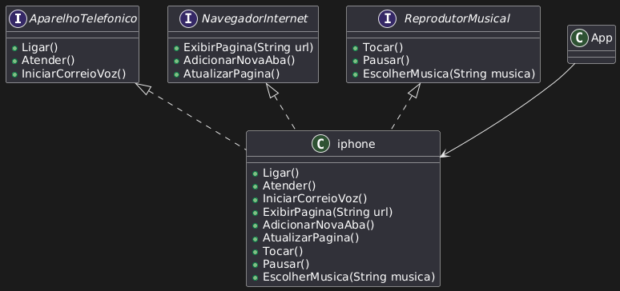

# Projeto iPhone - Simulação de um Dispositivo

Este projeto implementa uma simulação de um dispositivo iPhone, que possui as funcionalidades de um **aparelho telefônico**, um **navegador de internet** e um **reprodutor musical**. A classe `iphone` implementa três interfaces: `AparelhoTelefonico`, `NavegadorInternet` e `ReprodutorMusical`.

## Diagrama UML

Abaixo está o diagrama UML da estrutura do projeto:

## Funcionalidades

### 1. Aparelho Telefônico
- **Ligar**: Faz uma chamada.
- **Atender**: Atende uma chamada recebida.
- **Iniciar Correio de Voz**: Envia uma mensagem para o correio de voz.

### 2. Navegador de Internet
- **Exibir Página**: Exibe uma página da web com base em uma URL fornecida.
- **Adicionar Nova Aba**: Abre uma nova aba no navegador.
- **Atualizar Página**: Atualiza a página atual.

### 3. Reprodutor Musical
- **Tocar**: Inicia a reprodução de uma música.
- **Pausar**: Pausa a reprodução da música atual.
- **Escolher Música**: Escolhe uma música específica para reproduzir.
